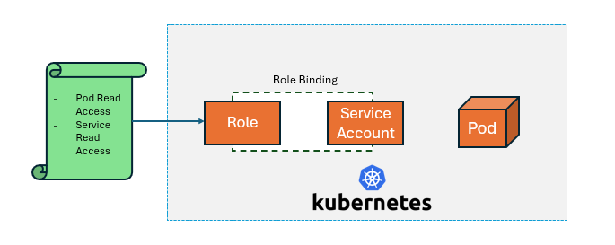

# Role Based Access Control


Role-based access control (RBAC) is a method of regulating access to computer or network resources based on the roles of individual users within your organization.

The RBAC API declares four kinds of Kubernetes object: Role, ClusterRole, RoleBinding and ClusterRoleBinding. 


`Role` 
- An RBAC Role or ClusterRole contains rules that represent a set of permissions. 
- A Role always sets permissions within a particular namespace; we have to specify the namespace when we create a role.

`ClusterRole`
- It is a non-namespaced resource. It defines the permissions at the cluster level.

In summary, If you want to define a role within a namespace, use a Role; if you want to define a role cluster-wide, use a ClusterRole.

Here's an example Role in the "default" namespace that can be used to grant read access to pods-

```
apiVersion: rbac.authorization.k8s.io/v1
kind: Role
metadata:
  namespace: default
  name: pod-reader
rules:
- apiGroups: [""] # "" indicates the core API group
  resources: ["pods"]
  verbs: ["get", "watch", "list"]
```

similarly, we can create clusteRole, where the namespace would be omitted.  

`RoleBinding`

- A role binding grants the permissions defined in a role to a user or set of users. 
- It holds a list of subjects (users, groups, or service accounts), and a reference to the role being granted.

`ClusterRoleBinding`

- A RoleBinding grants permissions within a specific namespace whereas a ClusterRoleBinding grants that access cluster-wide.
- If you want to bind a ClusterRole to all the namespaces in your cluster, you use a ClusterRoleBinding.





Here is an example of a RoleBinding that grants the "pod-reader" Role to the user "jane" within the "default" namespace

```
apiVersion: rbac.authorization.k8s.io/v1
kind: RoleBinding
metadata:
  name: read-pods
  namespace: default
subjects:
# You can specify more than one "subject"
- kind: User
  name: jane # "name" is case sensitive
  apiGroup: rbac.authorization.k8s.io
roleRef:
  # "roleRef" specifies the binding to a Role / ClusterRole
  kind: Role #this must be Role or ClusterRole
  name: pod-reader # this must match the name of the Role or ClusterRole you wish to bind to
  apiGroup: rbac.authorization.k8s.io
```

To list all the APIs and their verbs in kubernetes

```
kubectl api-resources -o wide
```


`Subjects`

- A RoleBinding or ClusterRoleBinding binds a role to subjects. Subjects can be groups, users or ServiceAccounts.
- We can provide access to inidvidual users so that they can access limited pods/deployment or perform limited actions in a cluster.
- Service Accounts can also be used to grant access to applications to perform any actions. 
- Granting access to an inidividual user required to setup the necessary certificates whereas the service accounts are straight forward setup. 


## Scenario-1

Create a user in kubernetes and grant pod read access in test namespace. 


1. Create user CSR

```
openssl genrsa -out vivek.key 2048
openssl req -new -key vivek.key -out vivek.csr
```

2. Approve the CSR. We need the ca.crt and ca.key of the kubernetes cluster. In self-managed clusters, it would be available at /etc/kubernetes/pki. In minikube, it would be available at ~/.minikube 

```
openssl x509 -req -in vivek.csr -CA /etc/kubernetes/pki/ca.crt -CAkey /etc/kubernetes/pki/ca.key -CAcreateserial -out vivek.crt -days 500
```

3. Now, you have two files, vivek.key and vivek.crt. 

4. Create a role with pod read permissions in test namespace.

```
apiVersion: rbac.authorization.k8s.io/v1
kind: Role
metadata:
  namespace: test
  name: pod-reader-role
rules:
- apiGroups: [""] # "" indicates the core API group
  resources: ["pods"]
  verbs: ["get", "watch", "list"]
```

5. Create the RoleBindings

```
apiVersion: rbac.authorization.k8s.io/v1
kind: RoleBinding
metadata:
  name: pod-reader-rolebinding
  namespace: test
subjects:
- kind: User
  name: vivek
  apiGroup: rbac.authorization.k8s.io
roleRef:
  kind: Role 
  name: pod-reader-role
  apiGroup: rbac.authorization.k8s.io
```

6. Now, set the configuration for vivek user.

```
kubectl config set-credentials vivek --client-certificate=vivek.crt --client-key=vivek.key
kubectl config set-context vivek-context --cluster=minikube --namespace=test --user=vivek
```

7. We can check the pods list by running below commands

```
kubectl get pods 
# this should give authorization error.

kubectl get pods -n test 
# Here we should be able to see the pod list
```


## Scenario-2

This time we are going to create a serviceAccount and link it with a pod. Once done, we will check if we are able to perform defined actions.

1. Create a service account

```
vi rbac-sa.yml
```
```
apiVersion: v1
kind: ServiceAccount
metadata:
  name: read-only-sa

```
2. Create RBAC role that allows pods, service and deployment readability

```
vi rbac-role.yml
```
```
apiVersion: rbac.authorization.k8s.io/v1
kind: Role
metadata:
  name: read-only-role
rules:
  - apiGroups: [""]
    resources: ["pods"]
    verbs: ["get", "list", "watch"]
  - apiGroups: [""]
    resources: ["services"]
    verbs: ["get", "list", "watch"]
  - apiGroups: [""]
    resources: ["configmaps"]
    verbs: ["get", "list", "watch"]
  - apiGroups: ["apps"]
    resources: ["deployments"]
    verbs: ["get", "list", "watch"]
```

3. Now, lets create an RBAC role binding that will connect the Role and Service Account together.

```
vi rbac-rolebinding.yml
```
```
apiVersion: rbac.authorization.k8s.io/v1
kind: RoleBinding
metadata:
  name: read-only-role-binding
subjects:
  - kind: ServiceAccount
    name: read-only-sa
    namespace: default
roleRef:
  kind: Role
  name: read-only-role
  apiGroup: rbac.authorization.k8s.io
```

4. Next we will create a pod that utilizes the above service account. 

```
vi rbac-pod.yml
```
```
apiVersion: v1
kind: Pod
metadata:
  name: read-only-pod
spec:
  serviceAccountName: read-only-sa
  containers:
    - name: myapp
      image: nginx

```

5. Once the pod is up and running, we will go inside the pod and install the kubectl command

```
kubectl exec -it <pod name> -- bash

# Install kubectl command inside the pod

curl -LO "https://dl.k8s.io/release/$(curl -L -s https://dl.k8s.io/release/stable.txt)/bin/linux/amd64/kubectl"

chmod +x kubectl

```

6. From inside the pod, run the kubectl commands to check if we are able to list the pods/deployments. Also check if we can delete the pod.

```
# Listing the pods in default namespace
./kubectl get pods 

# Try to delete the pod 
./kubectl delete pod <pod name>

# Try to list the pods in kube-system namespace
./kubectl get pods -n kube-system

```

Observe the above results and compare with the Role assigned to the ServiceAccount.


