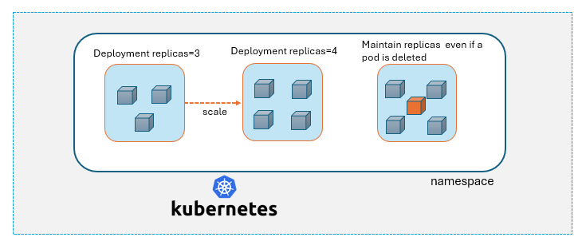

# Deployment

A Deployment in Kubernetes helps you run, manage, and update your app reliably across multiple pods, ensuring that your app is always available and can handle changes smoothly.

We instruct the deployment what our website looks like and how many pods we want to run based on the expected load. 

## Why we need Deployment to manage Pods 

- A Pod is not very reliable by itself. It can stop working or disappear at any time. Just like a worker might get sick or take a break, a Pod might crash or need to be restarted.
- Because a single Pod can’t be trusted to always be there, we need a way to manage multiple Pods to ensure our application stays up and running.

_The Deployment keeps an eye on the Pods. If one Pod stops working, the Deployment will create a new one to replace it. This way, there’s always enough Pods running to handle the workload._

- If we need more Pods to handle more work (like during a busy period), the Deployment can create additional Pods. If the workload decreases, it can reduce the number of Pods to save resources.

- When we need to update our app, the Deployment carefully replaces the old Pods with new ones. This ensures our app is always available, even during updates.




## Working with Deployments

1. Create an nginx deployment 

```
vi nginx-deployment.yml
```
```
apiVersion: apps/v1
kind: Deployment
metadata:
  name: nginx-deployment
  labels:
    app: nginx
spec:
  replicas: 3
  selector:
    matchLabels:
      app: nginx
  template:
    metadata:
      labels:
        app: nginx
    spec:
      containers:
      - name: nginx
        image: nginx:1.14.2
        ports:
        - containerPort: 80
```
```
kubectl apply -f nginx-deployment.yml
```

2. Listing the deployment and the pods created

```
kubectl get deployment 
# make sure to add the namespace in case the deployment was created in other than default.

kubectl get pods 
# this will list all the pods created by the deployment. In this case you will be seeing 3 pods created as we set the replica count to 3 in yaml file.
```

3. Test the Pod availability

```
# Delete any one pod out of those three
kubectl delete pod <podname>

# Again list the pods, you will see that a new pod is created to maintain the replica count 
kubectl get pods 
```

4. Updating the deployment replicas

We can either update the replica count in yaml file and rerun the apply command or use the kubectl scale command

```
kubectl scale deplyment <deployment name> --replicas=5

# Now you can list the pods, there will be 5 pods running for the deployment
kubectl get pods
```

5. Delete the deployment

As we noticed, deleting pods manually does not hamper the deployment working. It will keep on creating new pods to maintain the replicas. 
In case we want to delete hte deployment permanently

```
kubectl delete deployment <deployment name>

# If you have the yaml file available then 
kubectl delete -f nginx-deployment.yml
```
