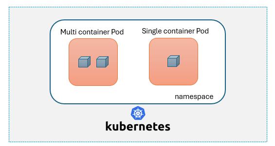

# Pods 

Pods are the smallest deployable units of computing that you can create and manage in Kubernetes.

A Pod is a group of one or more containers, with shared storage and network resources, and a specification for how to run the containers.

Pods in a Kubernetes cluster are used in two main ways:

**Pods that run a single container** The "one-container-per-Pod" model is the most common Kubernetes use case; in this case, you can think of a Pod as a wrapper around a single container; Kubernetes manages Pods rather than managing the containers directly.

**Pods that run multiple containers** Multiple containers in a single pod shares the same underlying resrouces and hence are useful in specific scenarios such as monitoring, logging etc. 




- You'll rarely create individual Pods directly in Kubernetes. This is because Pods are designed as relatively ephemeral, disposable entities. We usually create pods using Deployments or Daemonsets etc.

- Unlike containers, pods cannot be restarted. We can delete the pod permanently and a new pod will come up in its place (if running via deployment or daemonset)


## Working with pods

1. Create an nginx pod

```
kubectl run <podname> --image <imagename> 
```

    The same pod can be created using the yaml file as below-

```
vi pod.yml
```
```
apiVersion: v1
kind: Pod
metadata:
  name: nginx
spec:
  containers:
  - name: nginx
    image: nginx:1.14.2
    ports:
    - containerPort: 80
```
```
kubectl apply -f pod.yml
```

2. Listing the running pods in a cluster 

```
kubectl get pods 

# To list the pods in a particular namespace

kubectl get pods -n <namespace>

# To list the pods in all the namespaces

kubectl get pods --all-namespaces
```

3. To delete any pod in a cluster 

```
kubectl delete pod <podname>
# make sure the specify the namespace if the pod is not available in default namespace

# If you have the pod yaml file available then below command can be used to delete the pod
kubectl delete -f pod.yml

```


