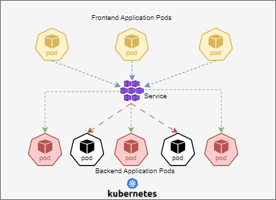

# Kubernetes Services 

In Kubernetes, a Service is a method for exposing a network application that is running as one or more Pods in your cluster.

If you use a Deployment to run your app, that Deployment can create and destroy Pods dynamically. From one moment to the next, you don't know how many of those Pods are working and healthy; you might not even know what those healthy Pods are named. Kubernetes Pods are created and destroyed to match the desired state of your cluster. Pods are ephemeral resources (you should not expect that an individual Pod is reliable and durable).

Each Pod gets its own IP address (Kubernetes expects network plugins to ensure this). For a given Deployment in your cluster, the set of Pods running in one moment in time could be different from the set of Pods running that application a moment later.

This leads to a problem: if some set of Pods (call them "backends") provides functionality to other Pods (call them "frontends") inside your cluster, how do the frontends find out and keep track of which IP address to connect to, so that the frontend can use the backend part of the workload?

Here comes the usage of `Services`.




## Creating a Service 

Suppose you have a pod that listens on TCP port 80 and is labelled as app.kubernetes.io/name: proxy. We can create a service for this pod as-

```
vi pod.yml
```
```
apiVersion: v1
kind: Pod
metadata:
  name: nginx
  labels:
    app.kubernetes.io/name: proxy
spec:
  containers:
  - name: nginx
    image: nginx:stable
    ports:
      - containerPort: 80
        name: http-web-svc
```
```
vi service.yml
```
```
apiVersion: v1
kind: Service
metadata:
  name: nginx-service
spec:
  selector:
    app.kubernetes.io/name: proxy
  ports:
  - name: name-of-service-port
    protocol: TCP
    port: 80
    targetPort: http-web-svc
```

Note the selector part of the service, it must match the label of our pod.

- This yaml will create a service as ClusterIP type. 

## Service Types

There are different types of services that you can use in kubernetes. 

`ClusterIP`

- Exposes the Service on a cluster-internal IP. 
- Choosing this value makes the Service only reachable from within the cluster.
- This is the default that is used if you don't explicitly specify a type for a Service.

`NodePort`

- Exposes the Service on each Node's IP at a static port (the NodePort)
- We need to set the type in service yaml file as "NodePort".

`Loadbalancer`

- Exposes the Service externally using an external load balancer.
- Kubernetes does not directly offer a load balancing component; you must provide one, or you can integrate your Kubernetes cluster with a cloud provider.

`ExternalName`

- Maps the Service to the contents of the externalName field, for example, to the hostname api.foo.bar.example.


### Creating a NodePort type service

Lets continue with the previous setup where we create a pod and a default service for it (ClusterIP type).
This time we will create a NodePort type service and assign it to the pod. 

```
vi nodeport-service.yml
```
```
apiVersion: v1
kind: Service
metadata:
  name: my-service
spec:
  type: NodePort
  selector:
    app.kubernetes.io/name: proxy
  ports:
    - port: 80
      targetPort: 80
      nodePort: 30007
```

- By default and for convenience, the Kubernetes control plane will allocate a port from a range (default: 30000-32767) 
- nodePort is optional field and use to give a definite port number from our side. Omitting it would assign any random port from the range. 


Load Balancer and ExternalName services would require extra setup (integration with cloud) hence they are not covered here in this document. 

### Working with Services

All these commands would work in defaukt namespace. Make sure to add the -n flag with these commands while working in other namespaces. 

1. To list the services in your cluster 

```
kubectl get service 
```

2. To check the pods associated with the service, we can describe it and check the endpoints.

```
kubectl describe service <servicename>
```